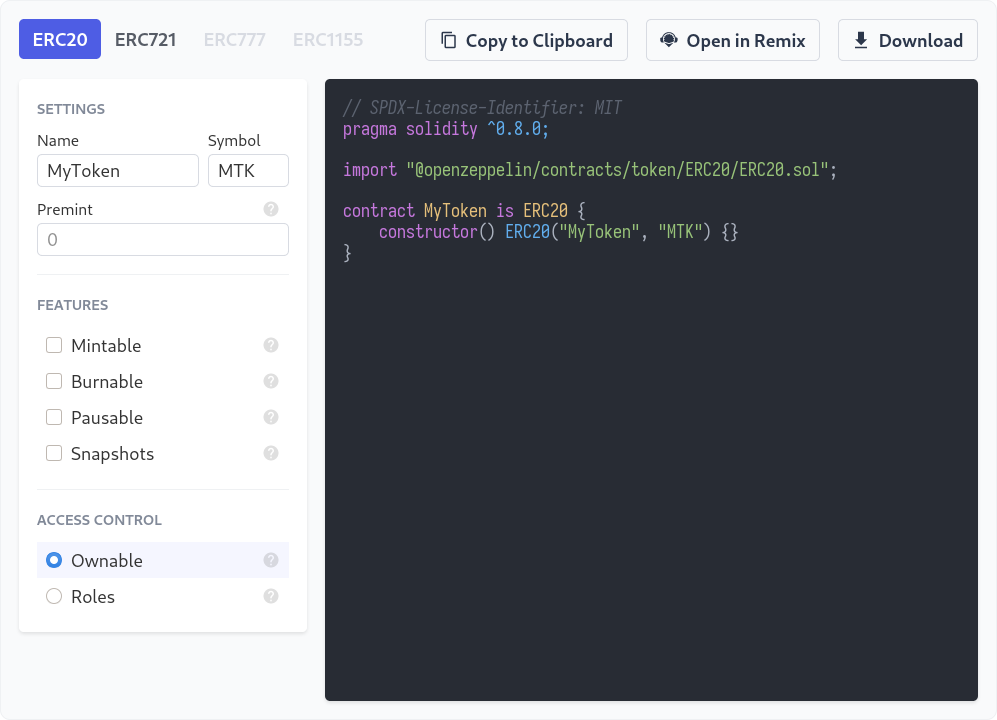

# [OpenZeppelin Contracts Wizard](https://wizard.openzeppelin.com)

Contracts Wizard is a web application to interactively build a contract out of components from OpenZeppelin Contracts. Select the kind of contract that you want, set your parameters and desired features, and the Wizard will generate all of the code necessary. The resulting code is ready to be compiled and deployed, or it can serve as a starting point and customized further with application specific logic.



## Development

`packages/core` contains the code generation logic.

`packages/ui` is the interface built in Svelte. `yarn dev` spins up a local server to develop the UI.

## Embedding

To embed Contracts Wizard on your site, first include the script tag:

```html
<script async src="https://wizard.openzeppelin.com/build/embed.js"></script>
```

Then place `<oz-wizard></oz-wizard>` in the body where you want Contracts Wizard to load.

Optionally focus on specific tab with the `data-tab` attribute as in `<oz-wizard data-tab="ERC721"></oz-wizard>`.
