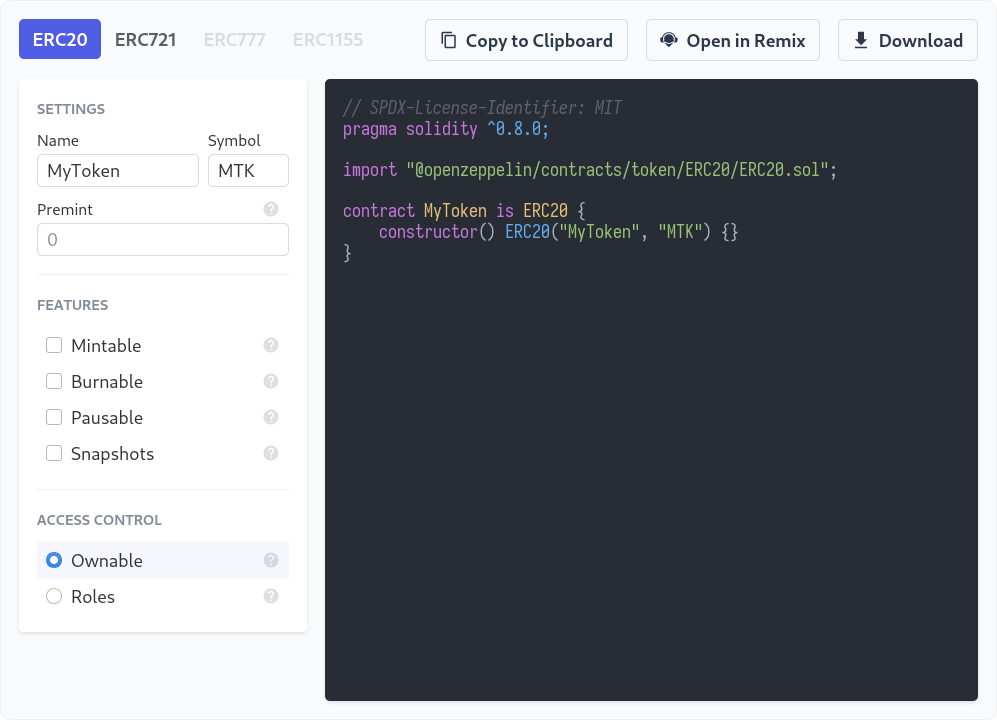

# [OpenZeppelin Contracts Wizard](https://wizard.openzeppelin.com)

[](https://www.npmjs.com/package/@openzeppelin/wizard)
[](https://www.npmjs.com/package/@openzeppelin/wizard-cairo)
[](https://www.npmjs.com/package/@openzeppelin/wizard-stellar)
[](https://www.npmjs.com/package/@openzeppelin/wizard-stylus)
[](https://www.npmjs.com/package/@openzeppelin/wizard-uniswap-hooks)
[](https://www.npmjs.com/package/@openzeppelin/contracts-cli)
[](https://www.npmjs.com/package/@openzeppelin/contracts-mcp)
[](https://app.netlify.com/sites/openzeppelin-contracts-wizard/deploys)

Contracts Wizard is a web application to interactively build a contract out of components from OpenZeppelin Contracts. Select the kind of contract that you want, set your parameters and desired features, and the Wizard will generate all of the code necessary. The resulting code is ready to be compiled and deployed, or it can serve as a starting point and customized further with application specific logic.

[](https://wizard.openzeppelin.com)

## Usage

Use the Contracts Wizard at https://wizard.openzeppelin.com

## CLI

Generate contracts from the command line. See the [CLI package](packages/cli/README.md).

## MCP Servers

Allow AI agents to generate contracts. See the [MCP package](packages/mcp/README.md) for local installation, or [OpenZeppelin MCP Servers](https://mcp.openzeppelin.com) for a hosted version.

## TypeScript API

Generate contracts programmatically from your own applications.

View the API documentation for each smart contract language:
- [Solidity](packages/core/solidity/README.md)
- [Cairo](packages/core/cairo/README.md)
- [Stellar](packages/core/stellar/README.md)
- [Stylus](packages/core/stylus/README.md)

## Embedding

To embed Contracts Wizard on your site, first include the script tag:

```html
<script async src="https://wizard.openzeppelin.com/build/embed.js"></script>
```

Then place `<oz-wizard></oz-wizard>` in the body where you want Contracts Wizard to load.

Optionally focus on specific tab with the `data-tab` attribute as in `<oz-wizard data-tab="ERC721"></oz-wizard>`.

For languages other than Solidity, use the `data-lang` attribute, for example: `<oz-wizard data-lang="cairo"></oz-wizard>`.

## Contributing

We welcome contributions from the community! Here's how you can get involved:

1. Fork the repository
2. Create your feature branch
3. Commit your changes
4. Push to the branch
5. Create a Pull Request

If you are looking for a good place to start, find a good first issue [here](https://github.com/openzeppelin/contracts-wizard/issues?q=is%3Aissue%20is%3Aopen%20label%3A%22good%20first%20issue%22), or [open an issue](https://github.com/OpenZeppelin/contracts-wizard/issues/new) for a bug report or feature request.

You can find more details in our [Contributing](CONTRIBUTING.md) guide.

## License

This project is licensed under the GNU Affero General Public License v3.0 - see the [LICENSE](LICENSE) file for details.
