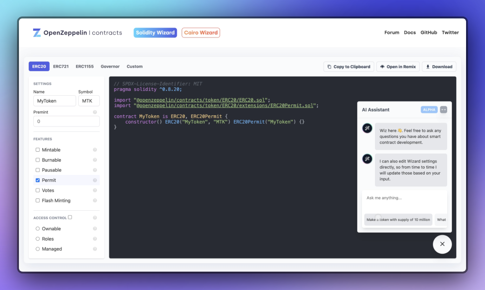

# [OpenZeppelin Contracts Wizard](https://wizard.openzeppelin.com)

[](https://www.npmjs.com/package/@openzeppelin/wizard)
[](https://www.npmjs.com/package/@openzeppelin/wizard-cairo)
[](https://www.npmjs.com/package/@openzeppelin/wizard-stellar)
[](https://www.npmjs.com/package/@openzeppelin/wizard-stylus)
[](https://app.netlify.com/sites/openzeppelin-contracts-wizard/deploys)

Contracts Wizard is a web application to interactively build a contract out of components from OpenZeppelin Contracts. Select the kind of contract that you want, set your parameters and desired features, and the Wizard will generate all of the code necessary. The resulting code is ready to be compiled and deployed, or it can serve as a starting point and customized further with application specific logic.

[](https://wizard.openzeppelin.com/)

## Contributing

See our [contributing guidelines](CONTRIBUTING.md).

## Embedding

To embed Contracts Wizard on your site, first include the script tag:

```html
<script async src="https://wizard.openzeppelin.com/build/embed.js"></script>
```

Then place `<oz-wizard></oz-wizard>` in the body where you want Contracts Wizard to load.

Optionally focus on specific tab with the `data-tab` attribute as in `<oz-wizard data-tab="ERC721"></oz-wizard>`.

For languages other than Solidity, use the `data-lang` attribute, for example: `<oz-wizard data-lang="cairo"></oz-wizard>`.

## API

The following describes how to use the Contracts Wizard programmatic API in your own applications.

- [Contracts Wizard API for Solidity](packages/core/solidity/README.md)
- [Contracts Wizard API for Cairo](packages/core/cairo/README.md)
- [Contracts Wizard API for Stellar](packages/core/stellar/README.md)
- [Contracts Wizard API for Stylus](packages/core/stylus/README.md)
